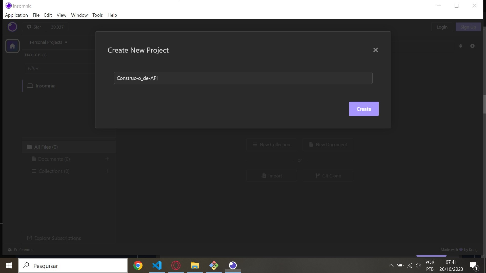

# Passo a passo da API, 1° parte
- Gerenciar projeto com gitBash
- Documentar passos e comandos
- Enviar para o gitHub

### Criar pasta para a aplicação
```
$ mkdir projetoBackend
```

### Acessar pasta
```
$ cd projetoBackend
```

### Criar arquivo para documentar projeto
```
$ touch readme.md
```

- Arquivos com extensão .md, significam markdown, de marcação de texto;
- A ideia é marcar um texto informando o que é importante, o que é um tópico, o que são links e imagens, sem a necessidade de utilizar marcações mais complexas, como o HTML;
- Utilizar este arquivo para descrever as ações executadas, de forma que facilite o entendimento;

### Iniciar o gerenciador de pacotes Node

```
$ npm init -y
```

- Deverá ser criado um arquivo package.json na raíz do projeto;
- Imagem do resultado do comando no terminal;

### Instalar os pacotes

```
$ npm i express nodemon dotenv
```
- express: framework web para construção da infraestrutura da API;
- nodemon: monitora as mudanças nos arquivos do projeto e reinicia automaticamente o servidor Node;
- dotenv: gerencia as variáveis de ambiente dentro do projeto;
- A confirmação da instalação dos pacotes pode ser vista na chave 'dependencies' no arquivo package.json, conforme imagem abaixo

### Abrir o VSCode
```
$ code .
```

### Criar arquivo .gitignore

```
$ nano .gitignore
```

- Com o comando nano, podemos criar e editar um arquivo pelo terminal;
- Ctrl + o: Salvar o arquivo;
- Enter: Confirmar;
- Ctrl + x: Fechar o arquivo;
- Este arquivo é utilizado para ignorar o envio de pastas e arquivos pro gitHub;

### Adicionar no arquivo .gitignore o nome da pasta criada após a instalação dos pacotes 
```
node_modules
```

- Esta pasta node_modules não precisamos enviar pro gitHub, pois pode ser recriada com o comando 'npm install';

### Criar estrutura de arquivos e pastas

```
$ mkdir src
```

### Criar arquivos dentro da pasta src
```
$ touch src/app.js
```

### Arquivo responsável de criar a configuração da API
```
$ touch src/server.js
```

### Arquivo responsável em receber as configurações da aplicação e rodar a API
- Criar pastas dentro da pasta src
```
$ mkdir src/config
```

### Pasta para gerenciar a conexão com o banco de dados
```
$ mkdir src/controllers
```

### Pasta para gerenciar as requisições das rotas e conexão com banco de dados
``` 
$ mkdir src/routes
```

### Pasta para gerenciar as rotas da API
- Validar estrutura do projeto
- Confira se a pasta do seu projeto esta igual a imagem com as pastas e arquivos
- Enviar estrutura do projeto para o gitHub
Inicializar o gerenciador de arquivos .git

```
$ git init
```

### Informar o seu nome e email
- Altere o campo 'FIRST_NAME' e coloque o seu nome
- Altere o campo 'EMAIL@EXAMPLE.COM' e coloque o seu email do gitHub
```
$ git config --global user.name "FIRST_NAME"
```

```
$ git config --global user.email "EMAIL@EXAMPLE.COM"
``` 

- Verificar arquivos que serão enviados ao gitHub

```
$ git status
```

Caso não apareça o node_modules faça isso aqui:
```
$ ls -a
```
```
$ rm -rf .git
```
```
$ ls -a
```

### Adicionar todos arquivos ao versionamento
```
$ git add .
```

### Salvar projeto e escrever comentário sobre o processo realizado

```
$ git commit -m 'estrutura do projeto'
```

- Criar um novo repositório no gitHub
- Clicar no ponto indicado na imagem para copiar a URL do repositório

### De volta ao terminal, executar o comando para definir a branch main
```
$ git branch -M main
```

- Informar o repositório que queremos enviar os arquivos

### Colar a URL do seu repositório copiada
```
$ git remote add origin COLAR_URL
```

### Enviar os arquivos para o gitHub
```
$ git push -u origin main
```

- Atualize a página no gitHub e verifique se os arquivos foram enviados

### Com o projeto no servidor remoto podemos remover os arquivos na nossa máquina
```
$ cd ..
```
- Comando para acessar uma pasta anterior

### Fechar o VSCode com o projeto aberto
```
$ rm -rf projetoBackend
```

- rm (remove): comando utilizado para apagar arquivo
- -r (recursive): apaga pastas e subpastas de forma recursiva
- -f (force): não pergunta confirmações
- projetoBackend: nome da pasta que contem os arquivos da aplicação

--- 

# Passo a passo da API, 2° parte

### Clone o seu antigo repositório no seu computador.
- Abrir o gitBash em um local do computador;
- Digitar o comando 'git clone' junto com a URL do seu repositório;

```
$ git clone COLAR_URL
```

### Acesse a pasta
- Digitar o comando 'cd' e o nome do seu repositório;
- cd (change directory): acessar outra pasta;
```
$ cd NOME_REPOSITORIO
```

### Reinstalar os pacotes de aplicação 

```
$ npm i
```
- Este comando irá recriar a pasta node_modules no projeto;

### Criar arquivo .env na raiz do projeto
- Este arquivo é utilizada para armazenar as variáveis que serão reutilizadas na aplicação;
- Com o comando nano, podemos criar e editar um arquivo pelo terminal;
- Ctrl + o: Salvar o arquivo;
- Enter: Confirmar;
- Ctrl + x: Fechar o arquivo;

```
$ nano .env
```

### Acesse o VS Code

```
$ code .
```

### Digitar no arquivo .env

```
PORT = 3008
```
- Variável que contém a porta que o servidor estará rodando;
- Esta arquivo .env não enviamos pro gitHub, pois contém informações sensíveis do sistema;

### Adicionar arquivo .env no .gitignore

```
$ nano .gitignore
```

```
.env
```

### Criar arquivo de exemplo para para as variáveis necessárias da aplicação
- Como não enviamos o arquivo .env para o gitHub, precisamos criar o exemplo das variáveis necessárias da aplicação;
- Este arquivo conterá apenas as variáveis, sem os valores correspondentes;

```
$ nano .env.example
```

- Escreva "PORT =";

### Abrir o arquivo app.js e digitar o código
- Importar o pacote express (servidor);
```
const express = require('express');
```

- Importar o pacote dotenv, gerenciador de variáveis de ambiente;

```
const dotenv = require('dotenv').config();
```

- Instanciar o express na variável app;

```
const app = express();
```

- Setar a porta do servidor a partir do arquivo .env;
- O operador condicional '||' significa 'OU', caso não tenha a variável PORT, será utilizado o valor - 3333';

```
app.set('port', process.env.PORT || 3333); 
```

- Exportar as configurações na variável app;
```
module.exports = app;
```

### Abrir o arquivo server.js e digitar os códigos

- Importar o arquivo app;
```
const app = require('./app');
```

- Importar a porta do servidor;

```
const port = app.get('port');
```

- Testar API com a função listen;
- 1º parâmetro: passamos a porta do servidor;
- 2º parâmetro: arrow function para retornar um console informando a porta que está rodando o servidor;

```
app.listen(port, () => {
    console.log(`Running on port ${ port }!`);
});
```

## Depois de configurar os pacotes e o teste do servidor, vamos criar o comando para executar

### Substituir o comando 'test' pelo comando 'start' na linha 7

```
"start":"nodemon src/server.js"
```

### Rodar o comando no termial com gitBash

```
$ npm run start
```

### Atualizar projeto no gitHub

- Adicionar todos arquivos ao versionamento;

```
$ git add .
```

- Salvar projeto e escrever comentário sobre o processo realizado;

```
$ git commit -m 'configuração do projeto'
```

- Enviar os arquivos atualizados para o gitHub;

```
$ git push
```

### Atualize a página no gitHub e verifique se os arquivos foram atualizados

- Com o projeto no servidor remoto podemos remover os arquivos na nossa máquina;

```
$ cd ..
```

- Comando para acessar uma pasta anterior;
- Fechar o VSCode com o projeto aberto;

```
$ rm -rf projetoBackend
```

- rm (remove): comando utilizado para apagar arquivo;
- r (recursive): apaga pastas e subpastas de forma recursiva;
- f (force): não pergunta confirmações;
- projetoBackend: nome da pasta que contem os arquivos da aplicação; 

--- 

# Passo a passo da API, 3° parte

### Clonar o repositorio na sua máquina
```
$ git clone COLAR_URL
```

### Acessar a pasta

```
$ cd NOME_REPOSITORIO
```

### Acesse o Visual Code

```
$ code .
```

### Abrir o arquivo rotas.js e digitar os códigos
```
// Importar o modulo de Router do express
const { Router } = require('express');

// Instanciar o Router na variável router
const router = Router();

router.get('/listar', (request, response) => {
    response.send('Método GET: listar informações');
});
router.post('/cadastrar', (request, response) => {
    response.send('Método POST: salvar informações');
});
router.put('/user/:id', (request, response) => {
    response.send('Método PUT: atualizar informações');
});
router.delete('/user/:id', (request, response) => {
    response.send('Método DELETE: remover informações');
});


module.exports = router;
```

### Abrir o arquivo app.js e adicionar o código
- Precisamos importar o arquivo de rotas nas configurações da API;
```
const router = require('./routes/rotas');
```
- Habilitar as rotas na aplicação;
- Esta linha deve inserida depois da criação da variável app;

```
app.use('/api', router);
```

### Atualizar projeto no gitHub
- Adicionar todos arquivos ao versionamento;
```
$ git add .
```

### Salvar projeto e escrever comentário sobre o processo realizado
```
$ git commit -m 'rotas do projeto'
```

### Enviar os arquivos atualizados para o gitHub
```
$ git push
```
### Atualize a página no gitHub e verifique se os arquivos foram atualizados
- Com o projeto no servidor remoto podemos remover os arquivos na nossa máquina;
```
$ cd ..
```

- Comando para acessar uma pasta anterior;
- Fechar o VSCode com o projeto aberto;

```
$ rm -rf projetoBackend
```

- rm (remove): comando utilizado para apagar arquivo;
- -r (recursive): apaga pastas e subpastas de forma recursiva;
- -f (force): não pergunta confirmações;
- projetoBackend: nome da pasta que contem os arquivos da aplicação;

---
# Passo a passo, 4º parte

- Copiar url do repositório no gitHub;
- Clonar repositório no computador com o gitBash;
- Abrir o projeto no VSCode;
- Aprender a utilizar o insomnia;
---

## Clonar o repositório na sua máquina
- Abrir o gitBash em um local do computador;
- Digitar o comando 'git clone' junto com a URL do seu repositório;
```
$ git clone URL_REPOSITORIO
```

## Acessar pasta
- Digitar o comando 'cd' e o nome do seu repositório;
- cd (change directory): acessar outra pasta;
```
$ cd NOME_REPOSITORIO
```

---

## Insomnia
Quando você está criando sua API, vai precisar testar as rotas que serão criadas no projeto, é possível utilizar o próprio browser para testar, mas ele só pode enviar requisições do tipo get, e os dados retornados não são apresentados já formatados. Para usar as outras requisições como post, put e delete, será necessário usar softwares de terceiros, e nesse caso, é o insomnia. Ele é um programa open source feito em javascript. O programa é um testador de rotas para APIs, como todos os outros (por exemplo o postman), você coloca a url da API e o caminho da rota.

## Agora abra o insomnia no seu computador
- Agora precisamos dar um nome para esse projeto, a imagem a seguir sugere o nome 'Construc-o_de_API';
- Defina o nome do projeto e clique no botão 'Create';


- Com o projeto criado, precisamos criar uma coleção de requisições para esse projeto;
- Clique no botão 'New Collection;'
- Defina o nome da coleção e clique no botão 'Create';


- Agora estamos dentro do projeto 'Construc-o_de_API / Teste das rotas';
- Vamos criar a primeira requisição para a API clicando no botão 'New HTTP Request', indicado na tela a seguir;
- Será criar uma nova requisição no método GET
- Todas as requisições desta coleção ficaram listadas neste quadro da esquerda conforme a imagem;
- Podemos alterar o nome da requisição clicando no ícone de seta para baixo e selecionando a opção 'Rename';
- É importante renomear as requisições para deixarmos personalizadas e com a descrição de responsabilidade da requisição;


- Podemos alterar o método da requisição clicando no íconde de seta para baixo;


- Agora só precisamos descrever a url da nossa API com a porta que definimos (http://localhost:3000) e as rotas (/api/listar) que criamos no arquivo rotas.js do passo 3;


---

## Importante
Antes de clicar no botão 'Send' para executar a ação da rota, execute o comando 'npm start' no seu projeto para rodar a API e verifique se o retorno estará conforme a imagem a seguir, ou seja, rodando na porta definida para o servidor.

```
$ npm run start
```

- Após validar que a API esta rodando, executa a ação da rota clicando no botão 'Send';
- O Insomnia deverá retornar a mensagem descrita no método GET do nosso arquivo de rotas;

---

- ### Metódo post


- ### Metódo put


- ### Metódo get


- ### Metódo delete


- ### Após tudo salve seu progresso no seu repositório.

---

# Passo a passo, 5º parte 

- 5º Passo: Criar controllers para gerenciar as requisições das rotas
- Copiar url do repositório no gitHub
- Clonar repositório no computador com o gitBash
- Abrir o projeto no VSCode

## Clonar o repositório na sua máquina
- Abrir o gitBash em um local do computador
- Digitar o comando 'git clone' junto com a URL do seu repositório

```
$ git clone URL_REPOSITORIO
```

## Acessar pasta
- Digitar o comando 'cd' e o nome do seu repositório
- cd (change directory): acessar outra pasta
```
$ cd NOME_REPOSITORIO
```

## Reinstalar os pacotes da aplicação
```
$ npm i
```
- Este comando irá recriar a pasta node_modules no projeto

## Recriar arquivo .env
- Definir as variáveis no arquivo .env a partir das chaves definidas no arquivo .env.example
- Criar pasta 'controllers' dentro da pasta 'src'
```
$ mkdir scr/controllers
```

## Criar arquivo 'crudController.js' na pasta 'controllers'
```
$ touch src/controllers/crudController.js
```

## Colar os códigos no arquivo crudController.js
```
function listarDados(request, response) {
    response.send('Retorno de lista de informação do Banco de dados');
}

function gravarDados(request, response) {
    response.send('Método utilizado para salvar informações!');
}

function atualizarDados(request, response) {
    response.send('Método utilizado para editar informações!');
}

function deletarDados(request, response) {
    response.send('Método utilizado para deletar informações!');
}

module.exports = {
    listarDados,
    gravarDados, 
    atualizarDados, 
    deletarDados

}
```

## Alterar o arquivo 'rotas.js'
```
/ Importar pacote do express
const { Router } = require('express');
// Instanciar o Router na variavel router
const router = Router();
// Importar funções do controller para a rota acessar as funções
const { 
    listarDados,
    gravarDados,
    atualizarDados,
    deletarDados
 } = require('../controllers/crudController');

router.get('/listar', listarDados);

router.post('/gravar', gravarDados);

router.put('/atualizar/:id', atualizarDados);

router.delete('/deletar/:id', deletarDados);

module.exports = router;
```

## Conclusão do Passo 5
URL do repositório com:
- Estrutura do projeto
- Arquivo readme de documentação dos passos realizados
- Configuração
- Retorno de teste da API
- Arquivo de rotas com os métodos [GET, POST, PUT, DELETE]
- Arquivo com as funções de controller
- Imagem de cada método testado no Insomnia dentro do arquivo readme, conforme exibido na conclusão do passo 4

### Teste o insonmia
```
$ npm run start
```
- Se deu errado, veja se os nomes dos arquivos estão certos.

Conclusão, como é para ficar no insomnia:


# Passo a passo, 6º parte
- Copiar url do repositório no gitHub
- Clonar repositório no computador com o gitBash
- Abrir o projeto no VSCode
- Clonar o repositório na sua máquina
- Abrir o gitBash em um local do computador
- Digitar o comando 'git clone' junto com a URL do seu repositório

```
git clone URL_REPOSITORIO
```

## Acessar pasta
Digitar o comando 'cd' e o nome do seu repositório
- cd (change directory): acessar outra pasta

```
cd NOME_REPOSITORIO
```

## Reinstalar os pacotes da aplicação

```
npm i
```
- Este comando irá recriar a pasta node_modules no projeto

## Recriar arquivo .env

- Definir as variáveis no arquivo .env a partir das chaves definidas no arquivo .env.example
- Criar a configuração com o banco de dados
- Dentro da pasta 'src', vamos criar uma pasta de nome 'config'. Dentro desta pasta vamos criar um arquivo com nome 'db.js' e colar o código:

```
// Arquivo responsável pela configuração e conexão com o banco de dados
 
// Importar o pacote do mysql
const mysql = require('mysql2');

// Importar o pacote de acesso aos de variáveis de ambiente
require('dotenv').config();

// Estabelece a criação da conexão com banco 
const connection = mysql.createConnection({
    host: process.env.DB_HOST,
    user: process.env.DB_USER,
    password: process.env.DB_PASSWORD,
    database: process.env.DB_DATABASE
    port: process.env.DB_PORT
});

// Testa se o banco esta conectado
connection.connect((err) => {
  if (err) {
    console.log(`Erro na conexão com banco: ${err}`);
  } else {
    console.log("Mysql Connected!");
  }
});

module.exports = connection;

```

- Abrir o arquivo .env e digitar o conteúdo abaixo, conforme os comentários

##  Definir a porta do servidor. 
```
Ex: 3000
PORT = 

# DB_HOST: Domínio do servidor. Ex: 'localhost'
# DB_USER: Usuário do banco de banco de dados. Ex: 'root'
# DB_PASSWORD: Senha do banco de banco de dados. Ex: 'root'
# DB_DATABASE: Nome da base de dados criada. Ex: 'projeto_final'
# DB_PORT: Porta que MySql está instalado. Ex: '3306' ou '3308'

DB_HOST = 
DB_USER = 
DB_PASSWORD =
DB_DATABASE =
DB_PORT =
```

- Atualize a sua API
